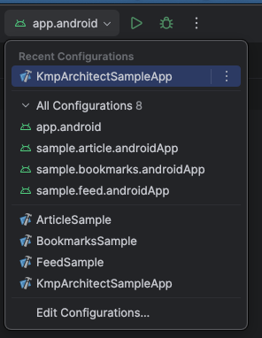
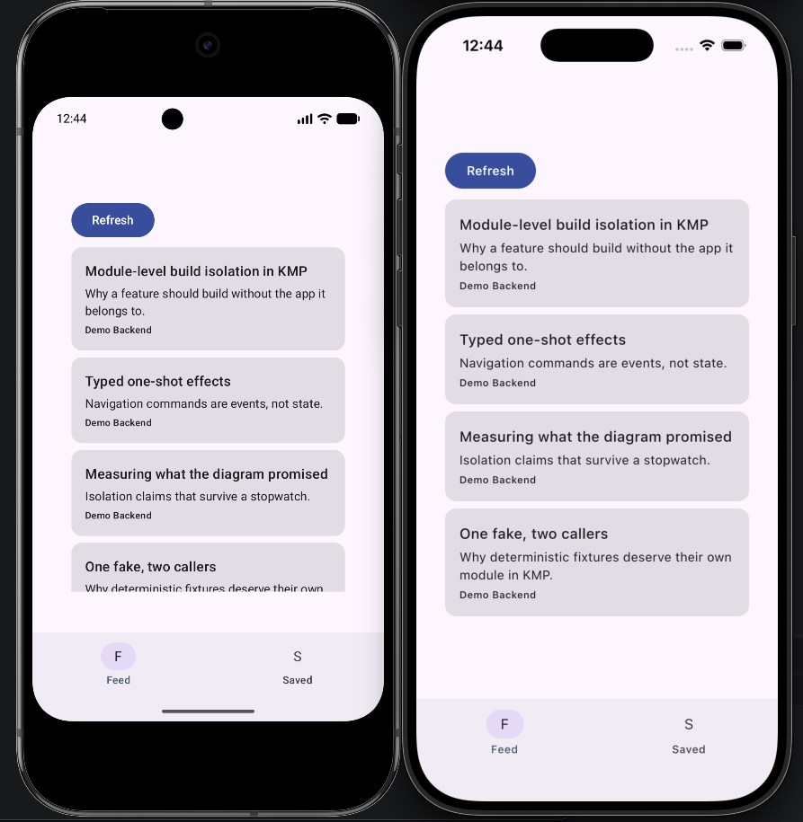
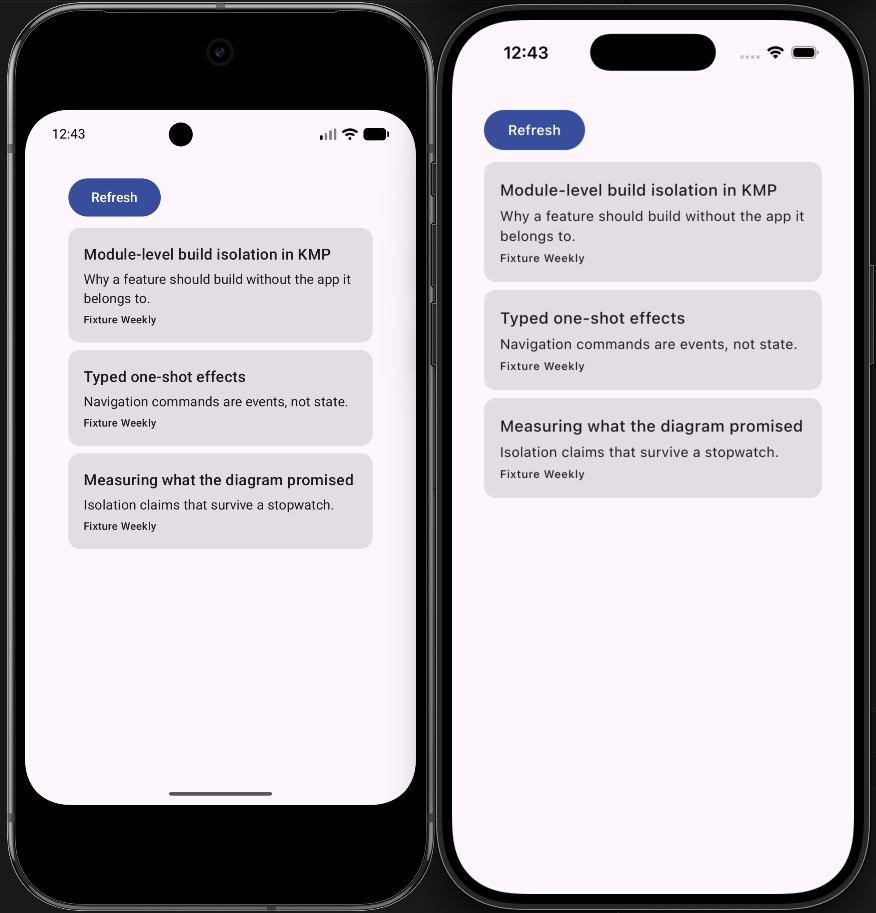
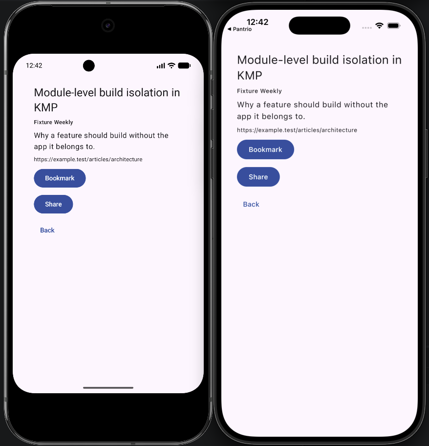
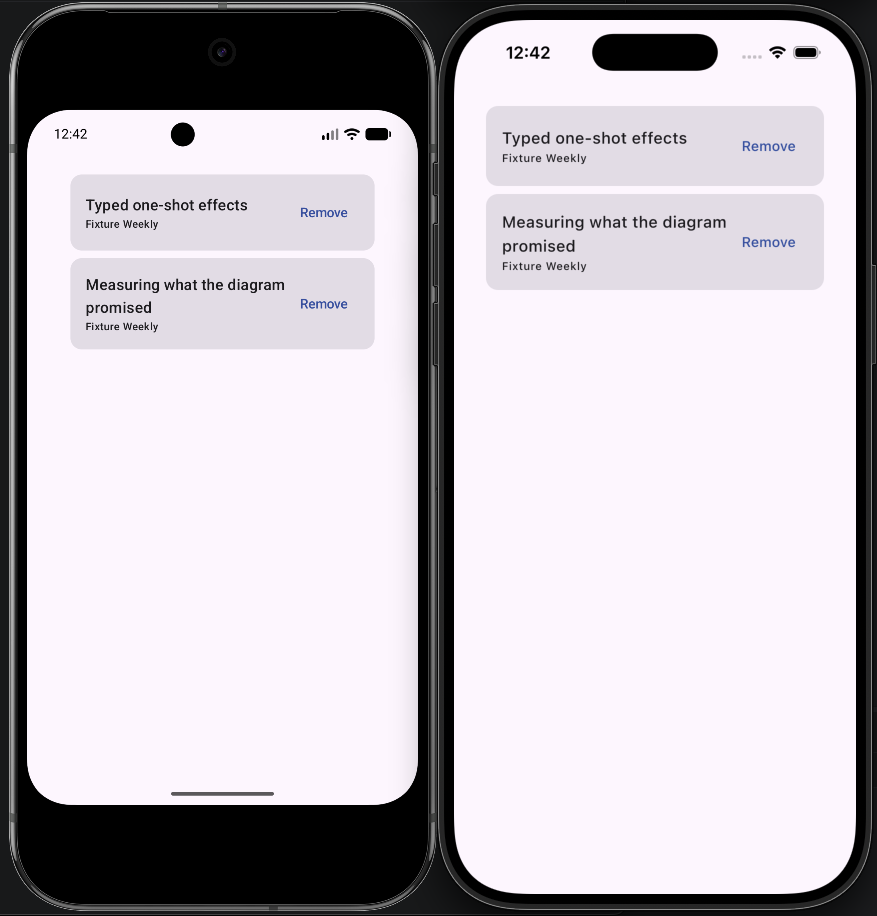

# KMP Architect Sample App

A feature-isolated Kotlin Multiplatform architecture for Android and iOS: **a developer working on
one feature builds and runs only that feature, never the whole application.**

Clean layering, MVI and typed navigation are here as means, not as the goal. The goal is a smaller
development loop, and the repository is built so that claim can be checked by a machine rather than
believed from a diagram.

The architecture was developed in a private codebase of **62 Gradle modules across 11 features**.
This repository is a three-feature reference implementation extracted from it — small enough to read
in an afternoon, complete enough to run the same gates on both platforms. Every number below comes
from *this* repository and is reproducible here.

## The claim, measured

Editing a line in a feature's `data` layer and rebuilding, on the same machine:

| Scenario | Production app | Feed sample | Bookmarks sample |
|---|---:|---:|---:|
| cold build | 236 tasks | 125 | 125 |
| no change | 20 tasks | 9 | 9 |
| presentation edit | 24 tasks | 13 | 13 |
| **data edit** | **24 tasks** | **9 — unchanged** | **9 — unchanged** |
| design-system edit | 24 tasks | 13 | 13 |

The bold row is the point. A change in the production data layer leaves both feature samples at
their no-change graph: nothing recompiles, because a sample is structurally forbidden from depending
on `data/*`. That single rule is what keeps the network client, the database driver, serialization
and DTO mapping out of the daily feature loop.

Method, host and raw repetitions: [docs/02-benchmarks.md](docs/02-benchmarks.md). Task count is the
portable signal; wall time is machine-specific and is reported without being dressed up — one sample
scenario was *slower* than production despite running half the tasks, and that is left in the table.

Two honest limits, stated up front: isolation does not reduce Gradle configuration time (more
modules cost more configuration), and it does not stop a shared design-system change from
recompiling the tree. Both are measured rather than argued away.

## The two gates

Folder shape is not evidence of isolation. A resolved dependency graph is.

```bash
./gradlew architectureCheck   # declared edges, external dependencies, source-level rules
./gradlew isolationCheck      # every sample's resolved graph vs. a checked-in allowlist
```

`architectureCheck` currently inspects 211 declared project edges, 832 external edges and 85
production sources. It rejects forbidden layer directions, feature-to-feature edges, `api` exposure
that is not justified in `config/api-allowlist.txt`, fixtures consumed by anything but their own
feature's tests and sample, ViewModels retaining native controllers, repository lookup from
composables, and effects stored in replaying state. Every rule has a rejection fixture beside it in
`build-logic`; a rule without one is treated as unproven.

`isolationCheck` runs **once per sample per platform** — six checks for three features. The Android
graph comes from the executable's `debugRuntimeClasspath`, the iOS graph from the framework module's
`iosSimulatorArm64CompileKlibraries`. Checking only Android would say nothing about what the static
framework links.

| Sample | Android graph | iOS graph |
|---|---:|---:|
| Feed | 9 projects | 8 |
| Article | 10 projects | 9 |
| Bookmarks | 9 projects | 8 |

The difference is the Android executable host; the projects beneath it are identical on both
platforms, which one shared allowlist per sample now asserts instead of assuming. Adding
`:data:feed` to the Feed sample fails the gate by name:

```text
isolationCheck FAILED
  ios: :sample:feed:shared (iosSimulatorArm64CompileKlibraries)
    unexpected project on the resolved graph: :core:database
    unexpected project on the resolved graph: :data:feed
    forbidden external dependency reached the sample: app.cash.sqldelight:native-driver
    allowlist: sample/feed/isolation-allowlist.txt
```

Widening a sample is therefore a reviewable diff to `sample/<feature>/isolation-allowlist.txt`, not a
regression that surfaces months later as a slower build.

## What the app is

An offline-first article reader with three features — `feed`, `article`, `bookmarks` — across 30
modules. A Ktor client syncs into a SQLDelight store and local storage is the single observable
truth. The demo backend is a `MockEngine` selected in `app/shared`, so content negotiation, DTO
parsing and sync are all real code while results stay reproducible.

Each feature has its own runnable sample application on **both** platforms. A feature is not
finished until its sample runs on Android and iOS.

## What that looks like from the IDE



Eight run configurations: the production app and one per feature, on each platform. A developer
working on bookmarks picks `sample.bookmarks.androidApp` or `BookmarksSample` and never builds the
other two features, the app root, or the data layer.

### Production



Four articles from the demo backend, and the `Feed` / `Saved` tab bar. The tab bar exists only here:
deciding that two features share a navigation surface is a cross-feature decision, and `app/shared`
is the only module entitled to make one.

### The same feature, in its isolated sample



Three deterministic articles from `fixtures/feed`, and no tab bar — because the sample's graph
contains one feature. Same presentation code as the screen above; different composition root.





The article and bookmarks samples, each on both platforms. Every screenshot in this section is the
same build a developer runs during the day — not a demo mode inside the production app.

## Rules that produce the isolation

```text
presentation/* ──► domain/* ◄── data/*
       │               │            │
       └──────────► core/* ◄─────────┘

app/shared ──► presentation/domain/core + selected shared data implementations
platform hosts ──► app/shared
fixtures/<feature> ──► only its own domain/<feature>
sample/<feature> ──► presentation + domain + fixtures of that feature only
```

- **`sample → data` is forbidden.** The load-bearing rule; everything above is downstream of it.
- **No feature depends on another feature.** Cross-feature decisions belong to `app/shared` alone.
- **`implementation` by default.** Every `api` edge needs a recorded justification, because one
  unjustified re-export restores the recompilation cascade the module split was meant to remove.
- **No aggregating DI codegen in the feature build path.** This is why the container is runtime
  (Koin) — and why every composition root owes a graph-startup test.
- **`domain/*` is pure Kotlin.** No Compose, no Koin, no Android/UIKit, no DTOs.
- **MVI keeps Action, Event and Effect separate.** Reducers are pure and synchronous; effects are
  typed, one-shot and channel-delivered, never stored in replaying state.
- **Deterministic fakes live in `fixtures/<feature>`**, written once and consumed by both that
  feature's presentation tests and its sample — never duplicated between them.

These rules are stricter than three features require. They were written for eleven, and the reference
keeps them intact rather than relaxing them for a smaller demo.

## Repository shape

```text
build-logic/                 convention plugins + architecture rules (with their own unit tests)
app/{shared,android}         root graph, cross-feature routing, thin Android host
core/*                       mvi, navigation, common, model, designsystem, ui, network,
                             database, sharing
domain/{feed,article,bookmarks}        pure Kotlin
data/{feed,article,bookmarks}          + data/articlestore
fixtures/{feed,article,bookmarks}      deterministic fakes, shared by tests and samples
presentation/{feed,article,bookmarks}
sample/{feed,article,bookmarks}/{shared,androidApp}   + isolation-allowlist.txt each
iosApp/ iosSamples/          XcodeGen specs; generated projects are git-ignored
```

The authoritative specification of these rules is
[`.claude/skills/refactored-architecture/`](.claude/skills/refactored-architecture/) — the SKILL and
its five references. The repository is the proof; that directory is the contract.

## Building

The daily loop is one command:

```bash
./gradlew :sample:feed:androidApp:installDebug     # also :article, :bookmarks
```

Everything else:

```bash
./gradlew architectureCheck isolationCheck buildLogicTest   # the gates
./gradlew check                                             # all module tests
./gradlew :app:android:assembleDebug                        # production Android
./gradlew :app:shared:linkDebugFrameworkIosSimulatorArm64   # production iOS framework
```

Requires JDK 21 for the Gradle daemon (pinned via `gradle/gradle-daemon-jvm.properties`), Android
SDK 36, and Xcode for anything iOS. Versions live in `gradle/libs.versions.toml`; add dependencies
there rather than inline.

## iOS

Xcode projects are generated from reviewable XcodeGen specs rather than hand-edited:

```bash
./scripts/generate-xcode-projects.sh          # needs `brew install xcodegen`
open KmpArchitect.xcworkspace                 # both projects, all four schemes
open iosApp/KmpArchitectSampleApp.xcodeproj
open iosSamples/KmpArchitectSamples.xcodeproj
```

`KmpArchitect.xcworkspace` is hand-written (nine lines of `contents.xcworkspacedata`, no generated
UUIDs) and only references the two generated projects. Production and samples stay separate
projects — the workspace exists because an IDE binds to a single Xcode file, and binding it to a
project would hide whichever three schemes are not in it.

Production scheme: `KmpArchitectSampleApp`. Sample schemes: `FeedSample`, `ArticleSample`,
`BookmarksSample`.

Build, install and launch one of them on a simulator without opening Xcode — the iOS counterpart of
`:sample:feed:androidApp:installDebug`:

```bash
./scripts/run-ios-simulator.sh FeedSample     # also ArticleSample, BookmarksSample,
                                              # KmpArchitectSampleApp
```

In Android Studio the KMP plugin derives its own iOS run configurations from the single Xcode file
recorded in `.idea/xcode.xml`; pointing that at `KmpArchitect.xcworkspace` gives all four schemes
instead of only the production one.

Three of them are also checked in under `.idea/runConfigurations/` — `FeedSample`, `ArticleSample`
and `BookmarksSample`, each bound to its Xcode scheme, so a fresh clone lists the samples without
anyone configuring them. `KmpArchitectSampleApp` comes from the workspace itself. These are native
Apple run configurations and need the IDE's Apple support; on a host without it, the script above is
the equivalent.

Note for non-macOS hosts: Apple link and test tasks are silently **skipped** on Linux while Gradle
still reports `BUILD SUCCESSFUL`. Treat a green Linux build as evidence of nothing on iOS. The iOS
isolation gate is the one exception — it resolves dependency metadata rather than invoking the Apple
toolchain, so it is valid everywhere.

## Evidence

Nothing in this repository claims a result that was not run.

- [ARCHITECTURE_VALIDATION_REPORT.md](ARCHITECTURE_VALIDATION_REPORT.md) — every gate, command and
  result, including the seven failures found during validation and how each was fixed
- [docs/00-toolchain.md](docs/00-toolchain.md) — version constraints discovered by building, not by
  reading release notes
- [docs/01-ios.md](docs/01-ios.md) — macOS framework and Xcode host evidence, and its limits
- [docs/02-benchmarks.md](docs/02-benchmarks.md) — build-isolation measurements with environment,
  cache state and repetitions
- [docs/03-isolated-projects.md](docs/03-isolated-projects.md) — why Gradle Isolated Projects is
  *not* enabled, measured rather than assumed, plus the migration design kept for the day it matters
- `build/reports/architecture/` — generated edge and resolved-graph reports
- `build/benchmark-results.tsv` — raw benchmark repetitions

There is no CI in this repository: it is a sample application about an architecture, not a product,
so the gates are local Gradle tasks. Run the two commands above before trusting any structural
change.

## License

[Apache License 2.0](LICENSE).
